# Effect Overview

## [AbstractCubes](AbstractCubes.glsl)

- Creates a field of cubes moving to time / generated noise

> Replaces content

**Variables:**

`time`
`Spacing`
`Size`
`Wave`
`Noise`
`Red`
`Green`
`Blue`
## [AbstractPlane](AbstractPlane.glsl)
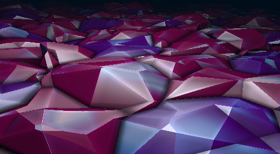

- Generates a moving field according to time

> Replaces content

**Variables:**

`time`
`Foreground Red`
`Foreground Green`
`Foreground Blue`
`Background Red`
`Background Green`
`Background Blue`
## [AddColor](AddColor.glsl)
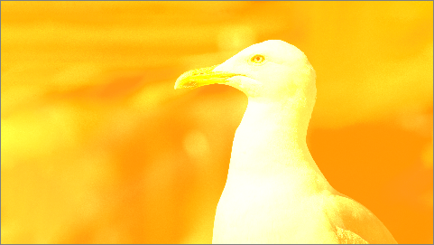

- Adds color layers over the current content

> 

**Variables:**

`Mix[%]`
`Red`
`Green`
`Blue`
`Alpha`
## [AlphaWipe](AlphaWipe.glsl)

- Smoothly transitions content with a directional wipe

> 

**Variables:**

`Mix[%]`
`Direction[deg]`
`Position[%]`
`Width[%]`
`Inverse`
## [BlackWhiteColor](BlackWhiteColor.glsl)

- Maps colors to a black and white spectrum

> 

**Variables:**

`Mix[%]`
`Exclude from red`
`to red`
`Exclude from green`
`to green`
`Exclude from blue`
`to blue`
## [BoxBlur](BoxBlur.glsl)
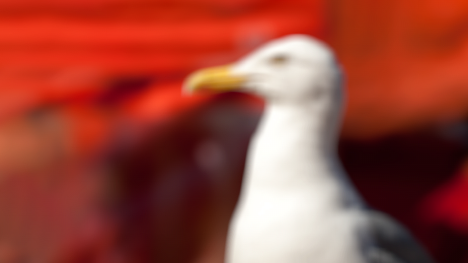

- Applies a box blur effect over content

> Mix% currently not in use (v1.9.149)

**Variables:**

`Mix[%]`
`Strength`
`Width[px]`
`Height[px]`
## [BoxBlurSep](BoxBlurSep.glsl)
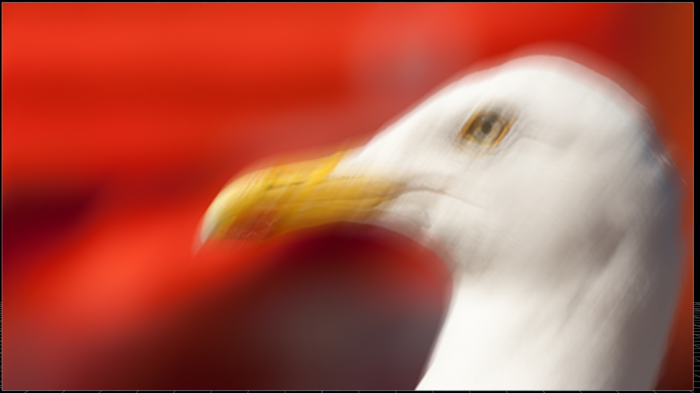

- Applies a directional box blur effect

> 

**Variables:**

`Mix[%]`
`Strength`
`Horizontal`
`Width[px]`
`Height[px]`
## [BrightnessContrast](BrightnessContrast.glsl)
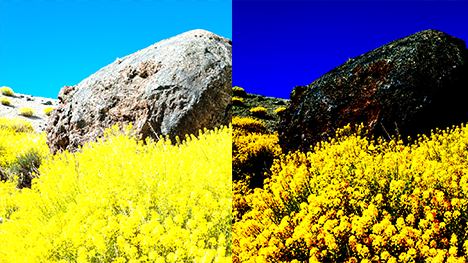

- Adjusts brightness and contrast of the content

> 

**Variables:**

`Mix[%]`
`Brightness[%]`
`Contrast[%]`
`Offset[%]`
## [Checkerboard](Checkerboard.glsl)

- Creates a checkerboard pattern

> 

**Variables:**

`Rows`
`Mix[%]`
`Width[px]`
`Height[px]`
`BlackColor Red`
`BlackColor Green`
`BlackColor Blue`
`BlackColor Alpha`
`WhiteColor Red`
`WhiteColor Green`
`WhiteColor Blue`
`WhiteColor Alpha`
`NonSquareAllowed`
## [ChromaKey](ChromaKey.glsl)
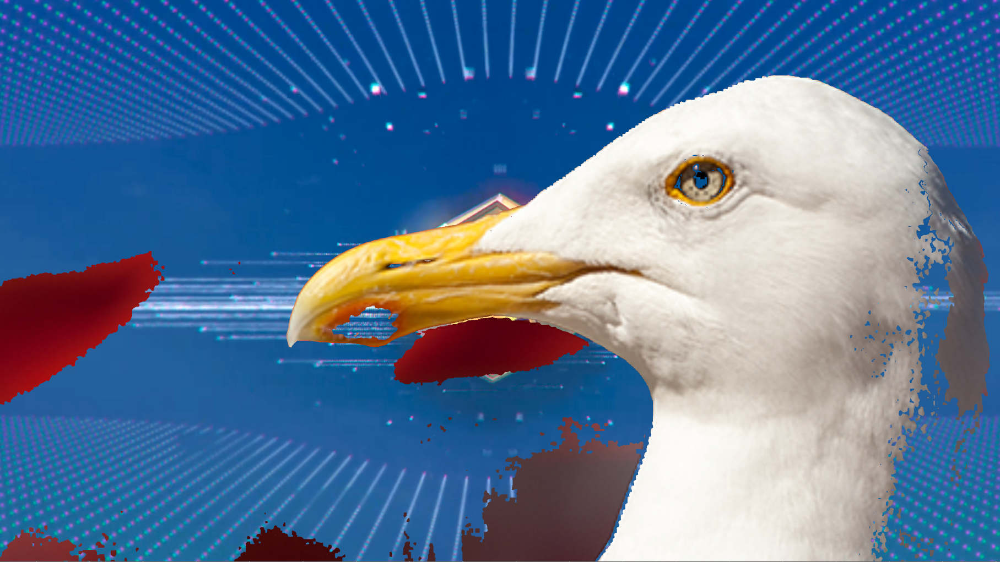

- Keys out a specific color range

> 

**Variables:**

`Mix[%]`
`Red`
`Green`
`Blue`
`HueTolerance`
`LightnessTolerance`
## [ClampColors](ClampColors.glsl)

- Clamps color values within specified ranges

> 

**Variables:**

`Mix`
`RedMin`
`RedMax`
`GreenMin`
`GreenMax`
`BlueMin`
`BlueMax`
## [ColorBorder](ColorBorder.glsl)

- Adds a colored border around content

> 

**Variables:**

`Mix[%]`
`Thickness`
`Color Red`
`Color Green`
`Color Blue`
`Color Alpha`
## [ColorChange](ColorChange.glsl)

- Modifies content color dynamically with time

> 

**Variables:**

`Mix[%]`
`Time`
`Speed`
## [ColorChannels](ColorChannels.glsl)
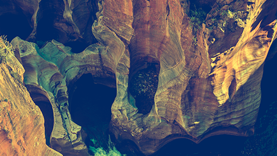

- Manipulates individual color channels

> 

**Variables:**

`Red`
`RedMix[%]`
`Green`
`GreenMix[%]`
`Blue`
`BlueMix[%]`
## [ColorStripes](ColorStripes.glsl)
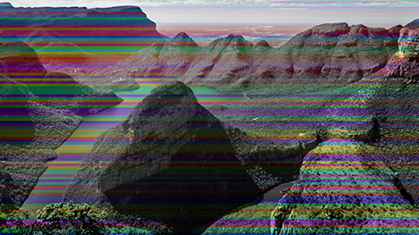

- Generates colored stripes over content

> 

**Variables:**

`Mix[%]`
`Amount`
`Seed`
`Vertical`
## [Cropping](Cropping.glsl)

- Crops the content with adjustable edges and angle

> 

**Variables:**

`Mix[%]`
`Left`
`Left Softness[%]`
`Top`
`Top Softness[%]`
`Right`
`Right Softness[%]`
`Bottom`
`Bottom Softness[%]`
`Angle[deg]`
## [CroppingHardEdge](CroppingHardEdge.glsl)

- Crops the content with hard edges and angle

> 

**Variables:**

`Left`
`Top`
`Right`
`Bottom`
`Angle[deg]`
## [DirectionalBlur](DirectionalBlur.glsl)
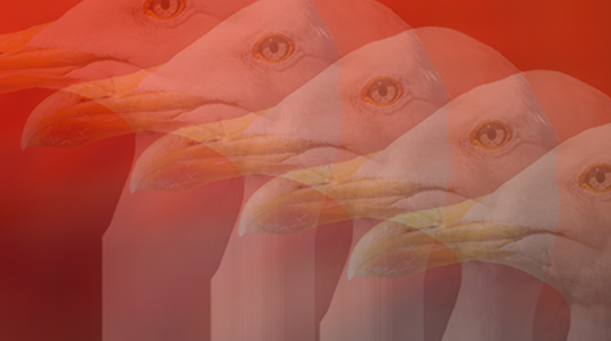

- Blurs content in a specified direction

> 

**Variables:**

`Strength`
`Angle`
`Samples`
## [Dissolve](Dissolve.glsl)
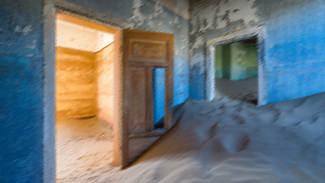

- Dissolves the content based on strength

> 

**Variables:**

`Mix[%]`
`Strength[%]`
## [DropShadow](DropShadow.glsl)

- Applies a shadow to content

> 

**Variables:**

`Mix[%]`
`Width[px]`
`Height[px]`
`Strength`
`Performance`
`Optimize`
`Angle[deg]`
## [DropShadowRect](DropShadowRect.glsl)
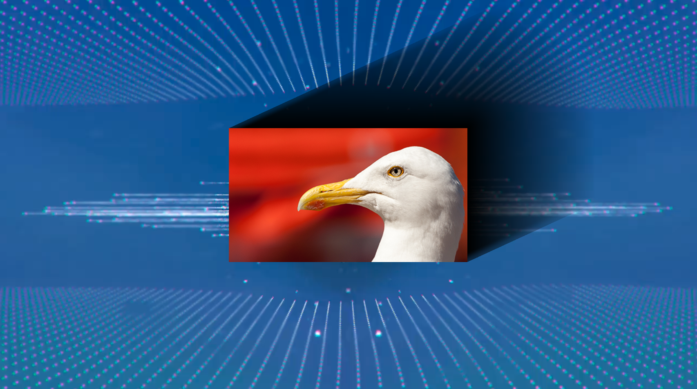

- Applies a rectangular drop shadow to scaled content

> 

**Variables:**

`Mix[%]`
`Width[px]`
`Height[px]`
`ShadowWidth[%]`
`Strength[%]`
`Angle[deg]`
## [Edges](Edges.glsl)
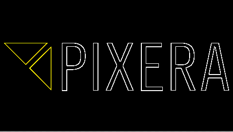

- Detects and emphasizes edges in content

> 

**Variables:**

`Mix[%]`
`Mode`
`Width[px]`
`Height[px]`
`Edge Width[px]`
## [Flip](Flip.glsl)

- Flips the content either horizontally or vertically

> 

**Variables:**

`Mix[%]`
`Horizontal`
`Vertical`
## [FlipColors](FlipColors.glsl)

- Flips between color channels

> 

**Variables:**

`Mix[%]`
`FlipRedGreen`
`FlipRedBlue`
`FlipGreenBlue`
## [Fog](Fog.glsl)

- Creates a fog effect influenced by time

> 

**Variables:**

`Mix[%]`
`Time`
`TimeMultiplier`
`Angle[deg]`
`FogStrength[%]`
`Red`
`Green`
`Blue`
## [GainGradientCorner](GainGradientCorner.glsl)
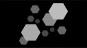

- Applies a corner gradient gain

> 

**Variables:**

`Position X`
`Position Y`
`Width X`
`Width Y`
`Strength[%]`
## [Gamma](Gamma.glsl)

- Adjusts the gamma of content

> 

**Variables:**

`Mix[%]`
`Gamma[%]`
## [GaussianBlur](GaussianBlur.glsl)

- Applies a Gaussian blur effect

> 

**Variables:**

`Mix[%]`
`Directions`
`Quality`
`Size`
`Width[px]`
`Height[px]`
## [GaussianSep](GaussianSep.glsl)

- Applies a directional Gaussian blur

> 

**Variables:**

`Mix[%]`
`Strength`
`Horizontal`
`Width[px]`
`Height[px]`
## [Glitch](Glitch.glsl)

- Introduces a glitch effect based on time

> 

**Variables:**

`Mix`
`time`
`Wave`
`Noise`
## [Gradient](Gradient.glsl)

- Generates a gradient between two colors and alpha

> 

**Variables:**

`Left color Red`
`Left color Green`
`Left color Blue`
`Left color Alpha`
`Right color Red`
`Right color Green`
`Right color Blue`
`Right color Alpha`
`Position`
`Width`
`Strength[%]`
`Angle`
## [HueSaturationValue](HueSaturationValue.glsl)

- Adjusts hue / saturation / and value of content

> 

**Variables:**

`Mix[%]`
`Hue[deg]`
`Saturation[%]`
`Value[%]`
## [Iris](Iris.glsl)

- Creates an iris effect with customizable color

> 

**Variables:**

`Mix[%]`
`xRadius`
`yRadius`
`Smoothness`
`xPosition`
`yPosition`
`Angle[deg]`
`Color Red`
`Color Green`
`Color Blue`
`Color Alpha`
`Invert`
`Width[px]`
`Height[px]`
## [Kaleidoscope](Kaleidoscope.glsl)

- Generates a dynamic kaleidoscope effect

> 

**Variables:**

`Mix[%]`
`time`
`Rotation speed`
`Amount`
## [Keystoning](Keystoning.glsl)
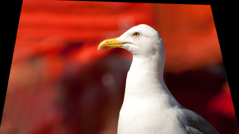

- Adjusts content's perspective through corner manipulation

> 

**Variables:**

`LeftUpperX`
`LeftUpperY`
`RightUpperX`
`RightUpperY`
`LeftLowerX`
`LeftLowerY`
`RightLowerX`
`RightLowerY`
## [LavaLamp](LavaLamp.glsl)
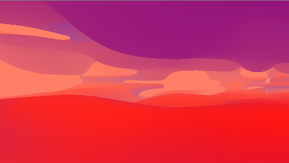

- Simulates a lava lamp effect with multiple colors

> Mixes with content

**Variables:**

`Mix[%]`
`time`
`Foreground Red`
`Foreground Green`
`Foreground Blue`
`Midground Red`
`Midground Green`
`Midground Blue`
`Background Red`
`Background Green`
`Background Blue`
## [LedEffect](LedEffect.glsl)

- Applies an LED screen effect

> Uses hardcoded 1920x1080 aspect ratio

**Variables:**

`Mix[%]`
`Amount`
`Softness[%]`
`Gap[%]`
`Gap Red`
`Gap Green`
`Gap Blue`
`Gap Alpha`
## [LumaKey](LumaKey.glsl)

- Keys out based on luminance values

> 

**Variables:**

`Mix[%]`
`MinLuma`
`MaxLuma`
`Softness`
## [MagnifyingGlass](MagnifyingGlass.glsl)
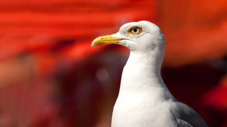

- Zooms in on a section of content

> Fixed aspect ratio of "lens"

**Variables:**

`Mix[%]`
`Radius`
`xPosition`
`yPosition`
`Scale[%]`
## [Mask](Mask.glsl)

- Applies a mask over content with transformations

> Sampler requires external content reference

**Variables:**

`Mix[%]`
`Sampler`
`RGB / Alpha`
`Invert`
`Border Alpha`
`Offset X`
`Offset Y`
`Rotate`
`Aspect Ratio`
`Scale X`
`Scale Y`
## [MaskRGB](MaskRGB.glsl)

- Masks content based on RGB values

> Sampler requires external content reference

**Variables:**

`Mix[%]`
`Sampler`
## [Mirror](Mirror.glsl)

- Mirrors content from a specified point

> 

**Variables:**

`Mix[%]`
`MirrorPosition[%]`
`Offset`
## [Movement](Movement.glsl)
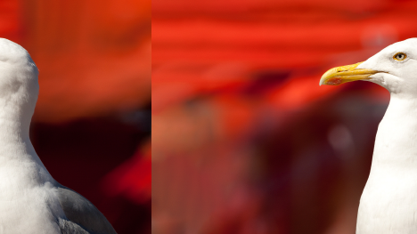

- Moves content based on time

> 

**Variables:**

`Mix[%]`
`Time`
`Speed`
`Vertical`
## [MultiplyAlpha](MultiplyAlpha.glsl)
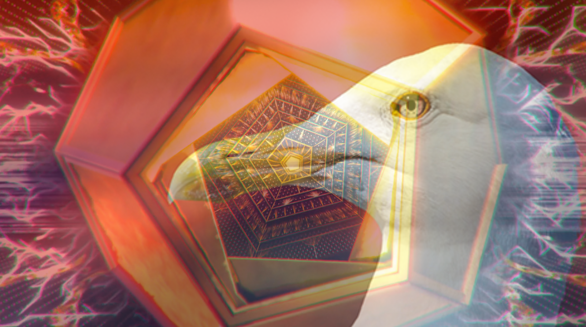

- Multiplies content's alpha transparency

> 

**Variables:**

`Mix[%]`
`Alpha[%]`
## [MultiplyColor](MultiplyColor.glsl)
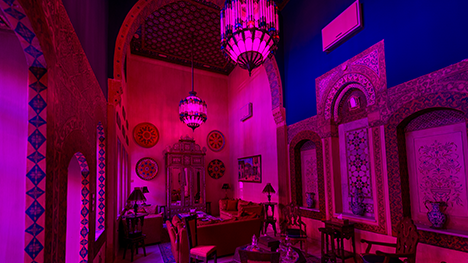

- Multiplies content with a specified color

> 

**Variables:**

`Mix[%]`
`Red`
`Green`
`Blue`
`Alpha`
## [Negative](Negative.glsl)
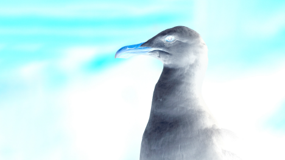

- Inverts the colors of content

> 

**Variables:**

`Mix`
## [Noise](Noise.glsl)

- Generates a noise pattern over content

> 

**Variables:**

`Size`
`Strength[%]`
`Time`
`Width[px]`
`Height[px]`
`BlackColor Red`
`BlackColor Green`
`BlackColor Blue`
`BlackColor Alpha`
`WhiteColor Red`
`WhiteColor Green`
`WhiteColor Blue`
`WhiteColor Alpha`
## [Opacity](Opacity.glsl)

- Adjusts the overall opacity of content

> 

**Variables:**

`Alpha[%]`
## [Pixelate](Pixelate.glsl)
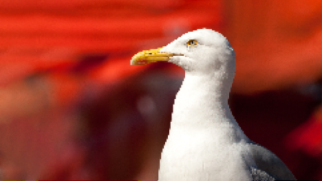

- Pixelates the content with adjustable size

> 

**Variables:**

`Width[px]`
`Height[px]`
`Pixels`
## [PolarCoordinates](PolarCoordinates.glsl)
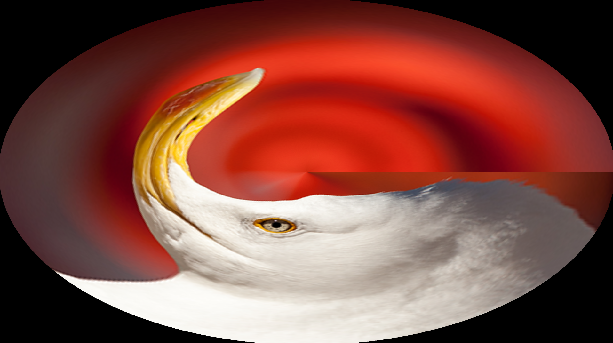

- Transforms content to polar coordinates

> 

**Variables:**

`X Pos`
`Y Pos`
`X Scale`
`Y Scale`
`Rotate`
## [RaymarchClouds](RaymarchClouds.glsl)

- Renders 3D clouds using raymarching

> 

**Variables:**

`Mix[%]`
`time`
`Focus`
`Treshold`
`Foreground Red`
`Foreground Green`
`Foreground Blue`
`Background Red`
`Background Green`
`Background Blue`
## [RectMaskSoft](RectMaskSoft.glsl)
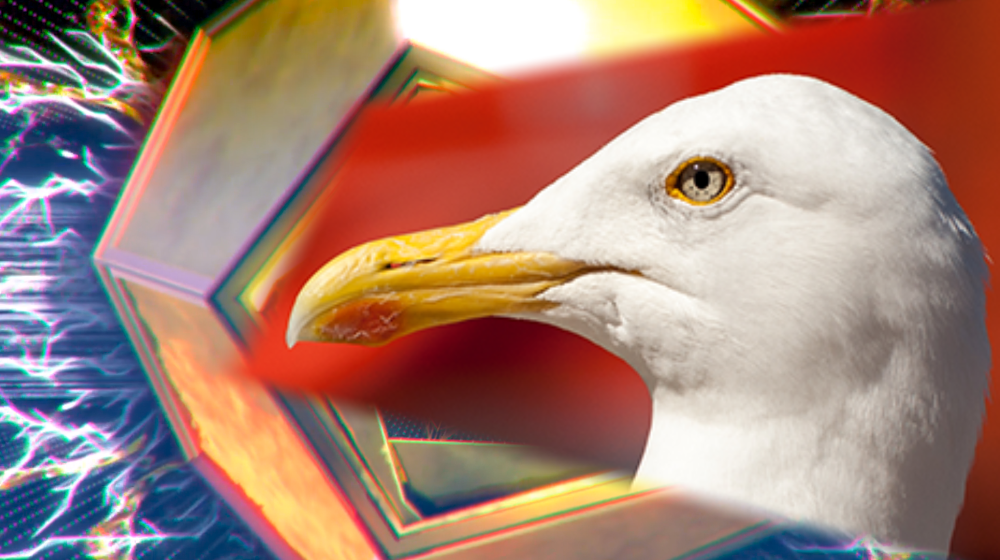

-  Soft-edged rectangular mask with customizable corner positions

> 

**Variables:**

`Mix[%]`
`Top Left X`
`Top Left Y`
`Top Right X`
`Top Right Y`
`Bottom Left X`
`Bottom Left Y`
`Bottom Right X`
`Bottom Right Y`
`Smoothness`
`Invert`
## [ReduceColors](ReduceColors.glsl)
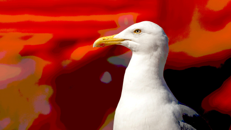

-  Reduces the number of distinct colors in the image for a posterized effect

> 

**Variables:**

`Mix[%]`
`RedValues`
`GreenValues`
`BlueValues`
## [Reflection](Reflection.glsl)

-  Creates a reflection effect based on position and strength

> 

**Variables:**

`Mix[%]`
`Strength`
`PositionY`
## [Relief](Relief.glsl)
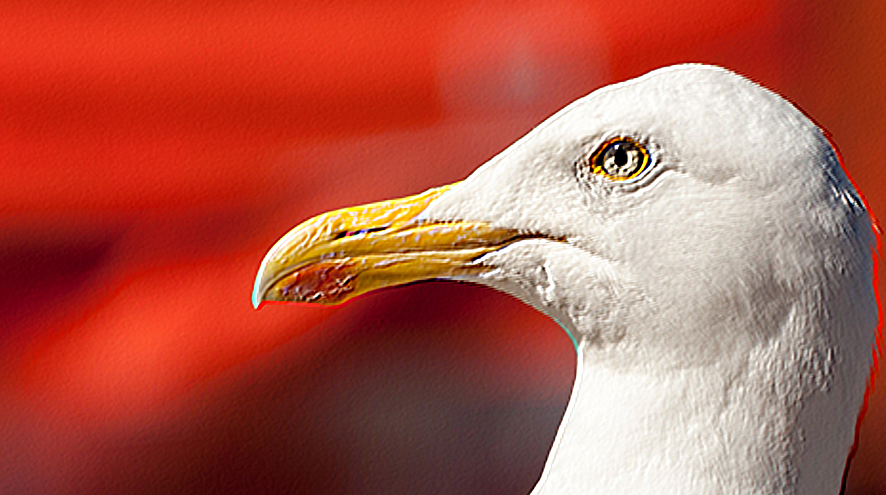

-  Generates a relief effect using the specified width / height / and direction

> 

**Variables:**

`Mix[%]`
`Direction`
`Width[px]`
`Height[px]`
## [RotateCenter](RotateCenter.glsl)

-  Rotates the content around the center at a specified angle and speed

> 

**Variables:**

`Mix[%]`
`Angle`
`Speed`
## [Rotation](Rotation.glsl)
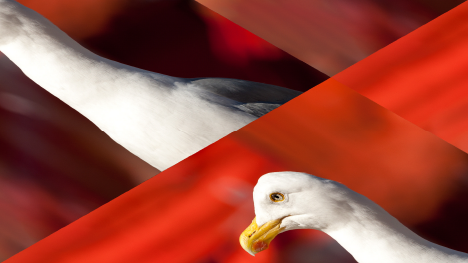

-  Rotates the content at a specified angle and speed

> 

**Variables:**

`Mix[%]`
`Angle`
`Speed`
## [Sepia](Sepia.glsl)

-  Applies a sepia tone to the image

> 

**Variables:**

`Mix[%]`
## [Sharpening](Sharpening.glsl)

-  Sharpens the image based on defined width / height / and strength

> 

**Variables:**

`Mix[%]`
`Width[px]`
`Height[px]`
`Strength`
## [Shockwave](Shockwave.glsl)

-  Creates a shockwave effect that animates over time"

> 

**Variables:**

`Mix[%]`
`Time`
`TimeMultiplier`
## [Solarize](Solarize.glsl)

-  Solarizes the image based on a threshold value

> 

**Variables:**

`Mix`
`Threshold`
`Below`
## [SolidColor](SolidColor.glsl)
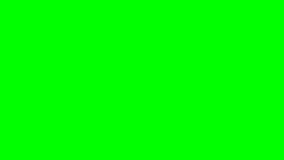

-  Renders a solid color overlay with customizable RGB values

> 

**Variables:**

`Mix`
`Red`
`Green`
`Blue`
`Alpha`
## [Spill](Spill.glsl)
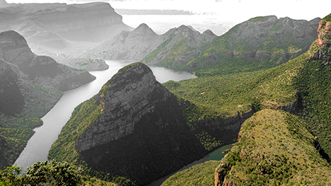

-  Manipulates color spill in the image with control over lightness and saturation

> 

**Variables:**

`Mix[%]`
`Red`
`Green`
`Blue`
`Lightness`
`Saturation`
`HueTolerance`
`LightnessTolerance`
## [SplitColors](SplitColors.glsl)

-  Splits RGB based on strength and angle

> 

**Variables:**

`Strength`
`Angle[deg]`
`Mix[%]`
## [Swirl](Swirl.glsl)

-  Applies a swirling effect to the image based on specified parameters

> 

**Variables:**

`Mix`
`PositionX`
`PositionY`
`Radius`
`Twist`
`Time`
## [Tiling](Tiling.glsl)
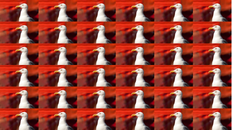

-  Repeats the image content in a tiled pattern

> 

**Variables:**

`Mix[%]`
`Factor`
## [TriGradient](TriGradient.glsl)

-  Generates a three-color gradient with customizable positions and colors

> 

**Variables:**

`Mix`
`Position1[%]`
`Position2[%]`
`Width[%]`
`Strength[%]`
`Angle[deg]`
`Color 1 Red`
`Color 1 Green`
`Color 1 Blue`
`Color 1 Alpha`
`Color 2 Red`
`Color 2 Green`
`Color 2 Blue`
`Color 2 Alpha`
`Color 3 Red`
`Color 3 Green`
`Color 3 Blue`
`Color 3 Alpha`
## [TriNoise2](TriNoise2.glsl)
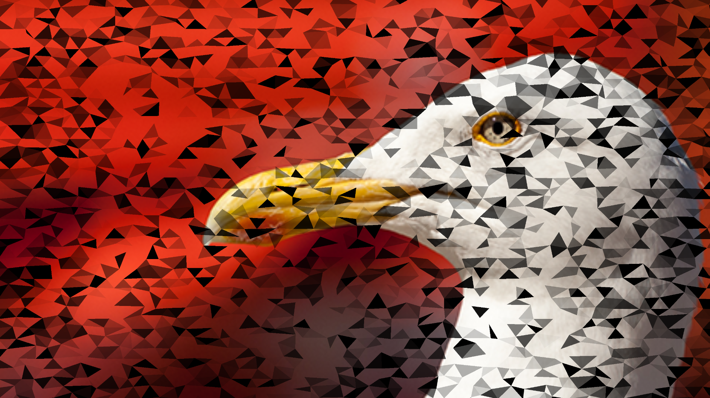

-  Applies a triangular noise effect

> 

**Variables:**

`time`
`amount`
`Mix`
## [UVPositionAndScale](UVPositionAndScale.glsl)

-  Adjusts the UV coordinates of the image for positioning and scaling

> 

**Variables:**

`X Pos`
`Y Pos`
`X Scale`
`Y Scale`
## [UVPositionAndScale_Unclamped](UVPositionAndScale_Unclamped.glsl)

-  Unclamped version of UV positioning and scaling

> 

**Variables:**

`X Pos`
`Y Pos`
`X Scale`
`Y Scale`
## [Vignette](Vignette.glsl)
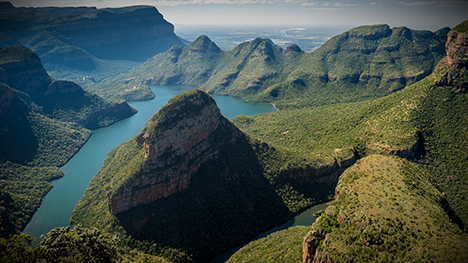

-  Applies a vignette effect to the image corners

> Fixed aspect ratio

**Variables:**

`Mix[%]`
`Width[%]`
## [Wipe](Wipe.glsl)

-  Wipes the image from a certain direction

> 

**Variables:**

`Mix[%]`
`X`
`Y`
## [Zoom](Zoom.glsl)

-  Zooms into the image from a specified position

> 

**Variables:**

`Mix[%]`
`xPosition`
`yPosition`
`Scale[%]`
## [DrivingPlates](DrivingPlates.glsl)

**Variables:**

`Sampler2`
`Sampler3`
`Sampler4`
`Sampler5`
`Sampler6`
`Sampler7`
`Sampler8`
`Sampler9`
`Position X`
`Position Y`
`Position Z`
`Rotation X`
`Rotation Y`
`Rotation Z`
`FOV`
`AspectRatio`
`Horizontal Feather`
`FOV Ceiling`
`AspectRatio Ceiling`
`Sampler`
## [Equirectangular](Equirectangular.glsl)

**Variables:**

`Position X`
`Position Y`
`Position Z`
`Rotation X`
`Rotation Y`
`Rotation Z`
`Sampler`
## [EquirectangularRanged](EquirectangularRanged.glsl)

**Variables:**

`Position X`
`Position Y`
`Position Z`
`Rotation X`
`Rotation Y`
`Rotation Z`
`Range Start`
`Range End`
`Sampler`
## [EquirectangularRangedBidirectional](EquirectangularRangedBidirectional.glsl)

**Variables:**

`Position X`
`Position Y`
`Position Z`
`Rotation X`
`Rotation Y`
`Rotation Z`
`Hor Range Start`
`Hor Range End`
`Ver Range Start`
`Ver Range End`
`Sampler`
## [Equirectangular_RotYXZ](Equirectangular_RotYXZ.glsl)

**Variables:**

`Position X`
`Position Y`
`Position Z`
`Rotation X`
`Rotation Y`
`Rotation Z`
`Sampler`
## [Perspective](Perspective.glsl)

**Variables:**

`Position X`
`Position Y`
`Position Z`
`Rotation X`
`Rotation Y`
`Rotation Z`
`FOV`
`AspectRatio`
`Sampler`
## [Planar](Planar.glsl)

**Variables:**

`Position X`
`Position Y`
`Position Z`
`Rotation X`
`Rotation Y`
`Rotation Z`
`Size`
`AspectRatio`
`Sampler`
