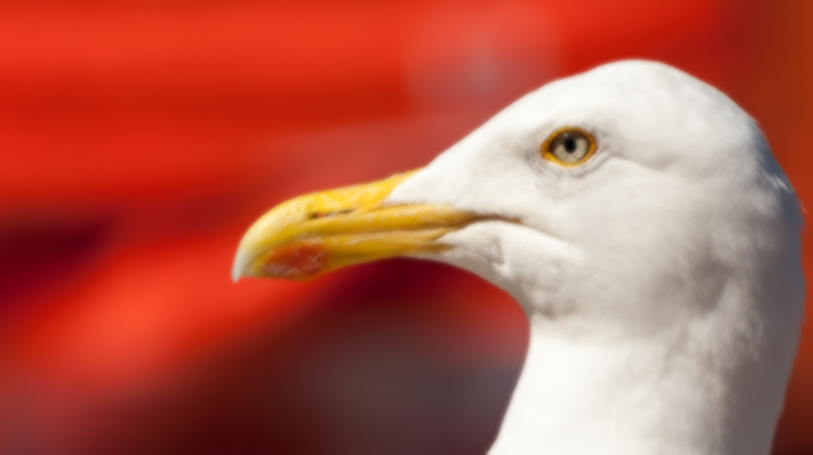
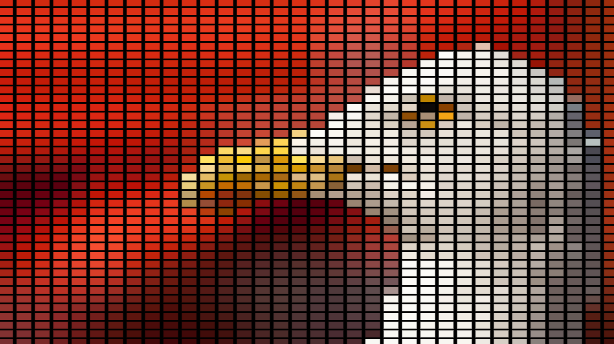
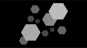
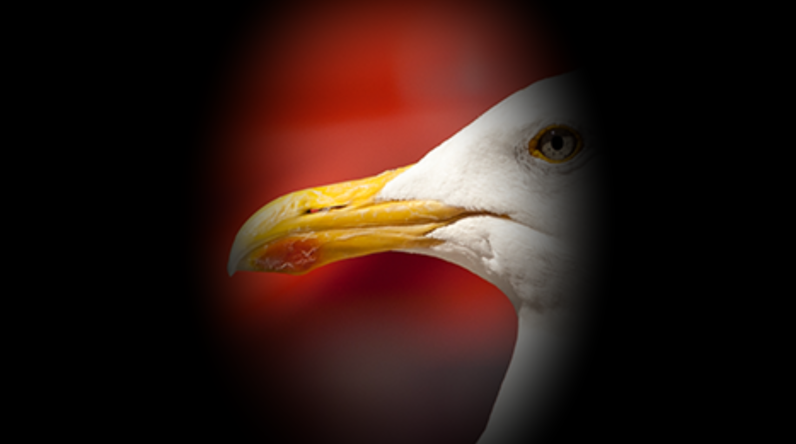

# Effect Overview

## [BoxBlur_Mix](BoxBlur_Mix.glsl)

- Applies a box blur effect over content

> Added in use of Mix%

**Variables:**

`Mix[%]`
`Strength`
`Width[px]`
`Height[px]`
## [LEDEffect_AspectRatio](LEDEffect_AspectRatio.glsl)

- Applies an LED screen effect

> Added aspect ratio and option for square pixels

**Variables:**

`Mix[%]`
`Amount`
`Softness[%]`
`Gap[%]`
`Gap Red`
`Gap Green`
`Gap Blue`
`Gap Alpha`
`Square`
`Width[px]`
`Height[px]`
## [Perspective_Mix](Perspective_Mix.glsl)

- Applies a perspective transform to the image

> Added in use of Mix% - **STILL CANCELS ANY LAYER POSITION / SCALE**

**Variables:**

`Mix[%]`
`Position X`
`Position Y`
`Position Z`
`Rotation X`
`Rotation Y`
`Rotation Z`
`FOV`
`AspectRatio`
`Sampler`
## [UVPositionAndScale_Mix](UVPositionAndScale_Mix.glsl)

- Adjusts the UV coordinates of the image for positioning and scaling

> Added mix% and XY scale together

**Variables:**

`Mix[%]`
`X Pos`
`Y Pos`
`X Scale`
`Y Scale`
`Scale`
## [Vignette_AspectRatio](Vignette_AspectRatio.glsl)

-  Applies a vignette effect to the image corners

> Added aspect ratio

**Variables:**

`Mix[%]`
`Strength[%]`
`Width[px]`
`Height[px]`
