# Effect Overview

## AbstractCubes
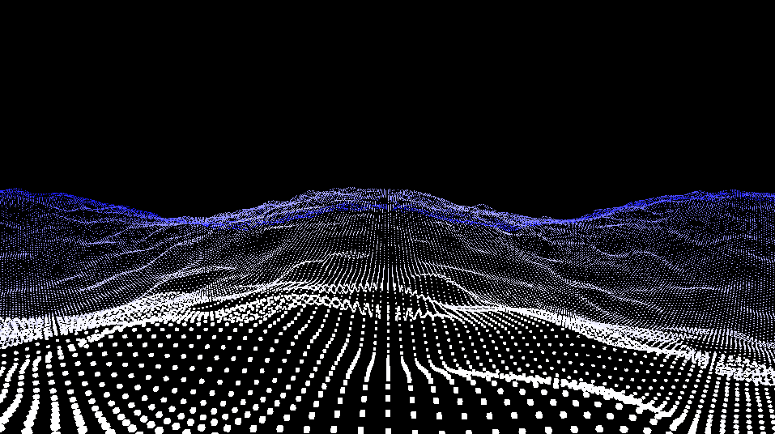

**Labels:**

`time`
`Spacing`
`Size`
`Wave`
`Noise`
`Red`
`Green`
`Blue`
## AbstractPlane
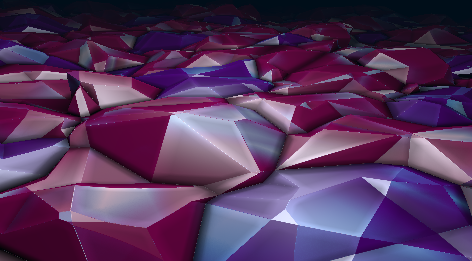

**Labels:**

`time`
`Foreground Red`
`Foreground Green`
`Foreground Blue`
`Background Red`
`Background Green`
`Background Blue`
## AddColor
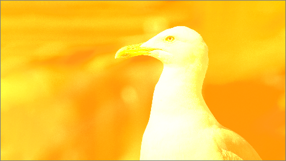

**Labels:**

`Mix[%]`
`Red`
`Green`
`Blue`
`Alpha`
## AlphaWipe
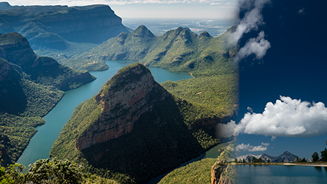

**Labels:**

`Mix[%]`
`Direction[deg]`
`Position[%]`
`Width[%]`
`Inverse`
## BlackWhiteColor
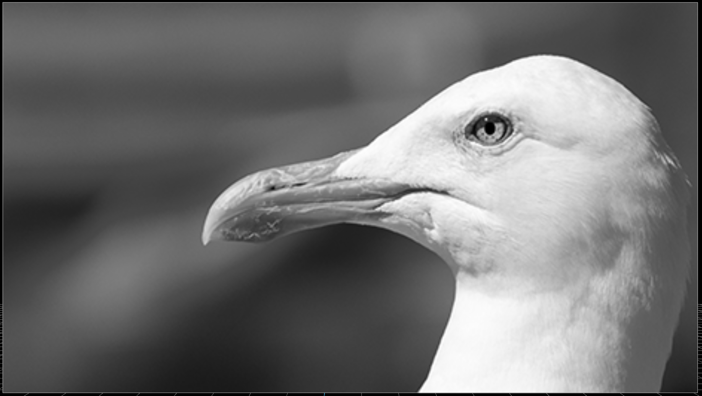

**Labels:**

`Mix[%]`
`Exclude from red`
`to red`
`Exclude from green`
`to green`
`Exclude from blue`
`to blue`
## Blank
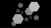

**Labels:**

`Dummy`
## BoxBlur
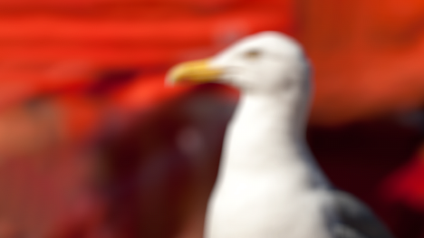

**Labels:**

`Mix[%]`
`Strength`
`Width[px]`
`Height[px]`
## BoxBlurSep

**Labels:**

`Mix[%]`
`Strength`
`Horizontal`
`Width[px]`
`Height[px]`
## BrightnessContrast
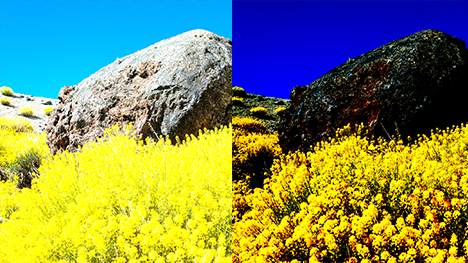

**Labels:**

`Mix[%]`
`Brightness[%]`
`Contrast[%]`
`Offset[%]`
## Checkerboard
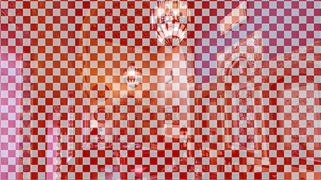

**Labels:**

`Rows`
`Mix[%]`
`Width[px]`
`Height[px]`
`BlackColor Red`
`BlackColor Green`
`BlackColor Blue`
`BlackColor Alpha`
`WhiteColor Red`
`WhiteColor Green`
`WhiteColor Blue`
`WhiteColor Alpha`
`NonSquareAllowed`
## ChromaKey

**Labels:**

`Mix[%]`
`Red`
`Green`
`Blue`
`HueTolerance`
`LightnessTolerance`
## ClampColors
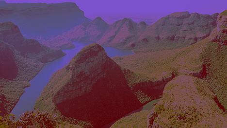

**Labels:**

`Mix`
`RedMin`
`RedMax`
`GreenMin`
`GreenMax`
`BlueMin`
`BlueMax`
## ColorBorder
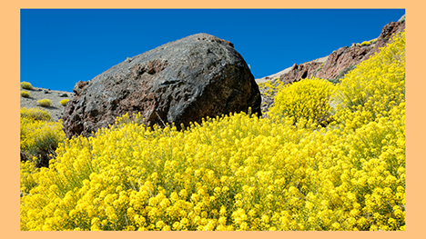

**Labels:**

`Mix[%]`
`Thickness`
`Color Red`
`Color Green`
`Color Blue`
`Color Alpha`
## ColorChange
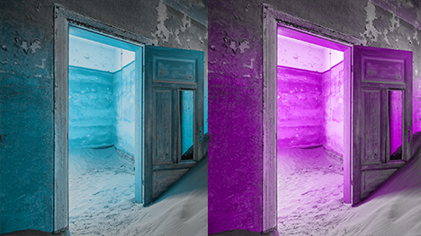

**Labels:**

`Mix[%]`
`Time`
`Speed`
## ColorChannels
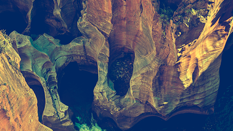

**Labels:**

`Red`
`RedMix[%]`
`Green`
`GreenMix[%]`
`Blue`
`BlueMix[%]`
## ColorStripes
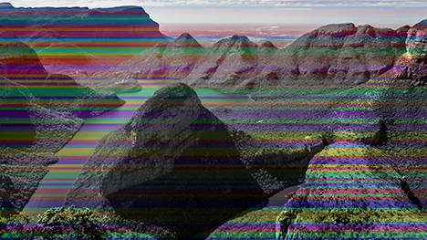

**Labels:**

`Mix[%]`
`Amount`
`Seed`
`Vertical`
## Cropping
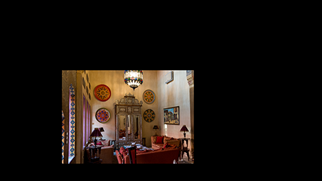

**Labels:**

`Mix[%]`
`Left`
`Left Softness[%]`
`Top`
`Top Softness[%]`
`Right`
`Right Softness[%]`
`Bottom`
`Bottom Softness[%]`
`Angle[deg]`
## CroppingHardEdge

**Labels:**

`Left`
`Top`
`Right`
`Bottom`
`Angle[deg]`
## DirectionalBlur

**Labels:**

`Strength`
`Angle`
`Samples`
## Dissolve
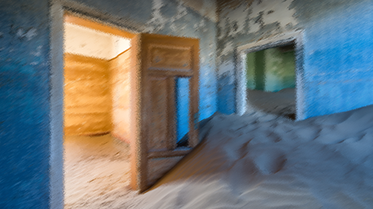

**Labels:**

`Mix[%]`
`Strength[%]`
## DropShadow
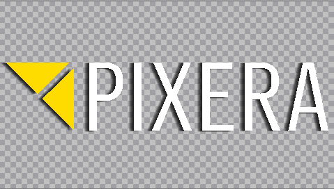

**Labels:**

`Mix[%]`
`Width[px]`
`Height[px]`
`Strength`
`Performance`
`Optimize`
`Angle[deg]`
## DropShadowRect

**Labels:**

`Mix[%]`
`Width[px]`
`Height[px]`
`ShadowWidth[%]`
`Strength[%]`
`Angle[deg]`
## Edges
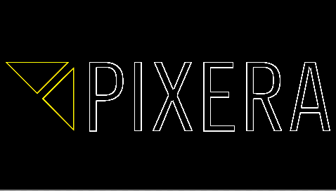

**Labels:**

`Mix[%]`
`Mode`
`Width[px]`
`Height[px]`
`Edge Width[px]`
## Flip
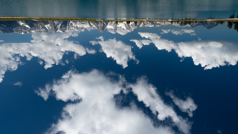

**Labels:**

`Mix[%]`
`Horizontal`
`Vertical`
## FlipColors
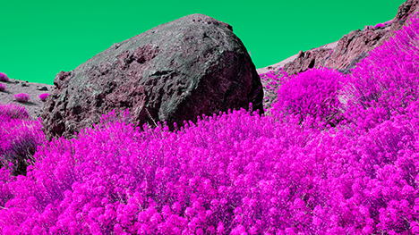

**Labels:**

`Mix[%]`
`FlipRedGreen`
`FlipRedBlue`
`FlipGreenBlue`
## Fog
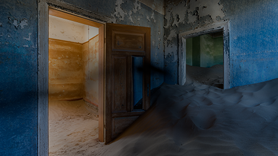

**Labels:**

`Mix[%]`
`Time`
`TimeMultiplier`
`Angle[deg]`
`FogStrength[%]`
`Red`
`Green`
`Blue`
## GainGradientCorner

**Labels:**

`Position X`
`Position Y`
`Width X`
`Width Y`
`Strength[%]`
## Gamma
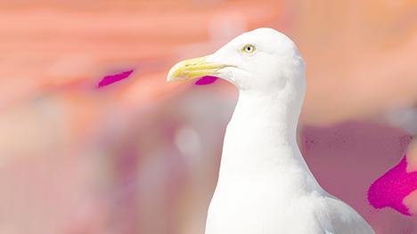

**Labels:**

`Mix[%]`
`Gamma[%]`
## GaussianBlur
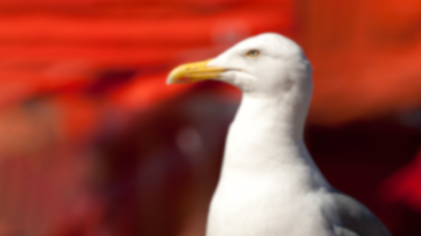

**Labels:**

`Mix[%]`
`Directions`
`Quality`
`Size`
`Width[px]`
`Height[px]`
## GaussianSep

**Labels:**

`Mix[%]`
`Strength`
`Horizontal`
`Width[px]`
`Height[px]`
## Glitch
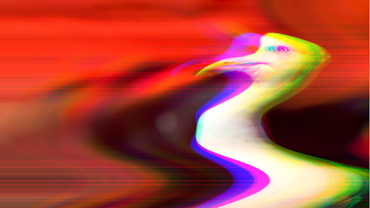

**Labels:**

`Mix`
`time`
`Wave`
`Noise`
## Gradient
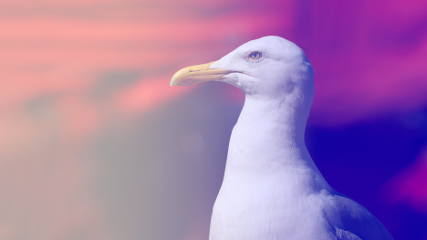

**Labels:**

`Left color Red`
`Left color Green`
`Left color Blue`
`Left color Alpha`
`Right color Red`
`Right color Green`
`Right color Blue`
`Right color Alpha`
`Position`
`Width`
`Strength[%]`
`Angle`
## HueSaturationValue
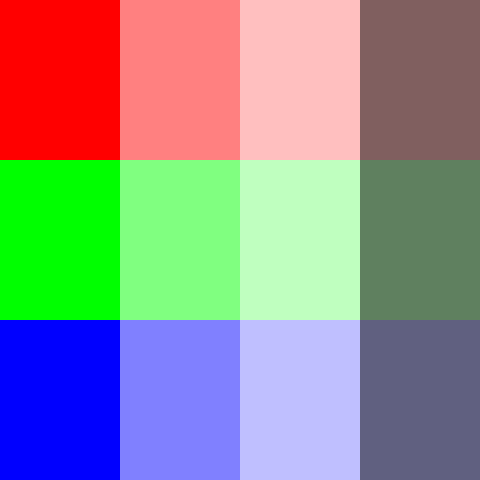

**Labels:**

`Mix[%]`
`Hue[deg]`
`Saturation[%]`
`Value[%]`
## Iris
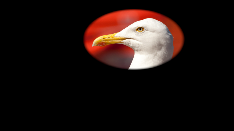

**Labels:**

`Mix[%]`
`xRadius`
`yRadius`
`Smoothness`
`xPosition`
`yPosition`
`Angle[deg]`
`Color Red`
`Color Green`
`Color Blue`
`Color Alpha`
`Invert`
`Width[px]`
`Height[px]`
## Kaleidoscope
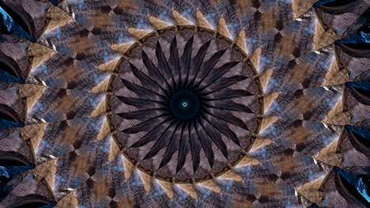

**Labels:**

`Mix[%]`
`time`
`Rotation speed`
`Amount`
## Keystoning
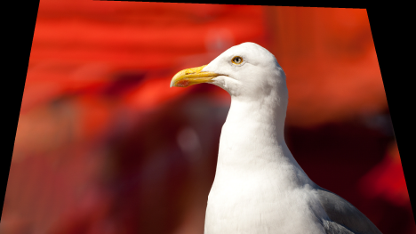

**Labels:**

`LeftUpperX`
`LeftUpperY`
`RightUpperX`
`RightUpperY`
`LeftLowerX`
`LeftLowerY`
`RightLowerX`
`RightLowerY`
## LavaLamp
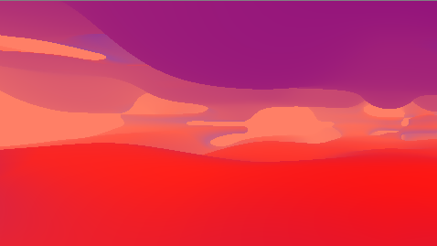

**Labels:**

`Mix[%]`
`time`
`Foreground Red`
`Foreground Green`
`Foreground Blue`
`Midground Red`
`Midground Green`
`Midground Blue`
`Background Red`
`Background Green`
`Background Blue`
## LedEffect
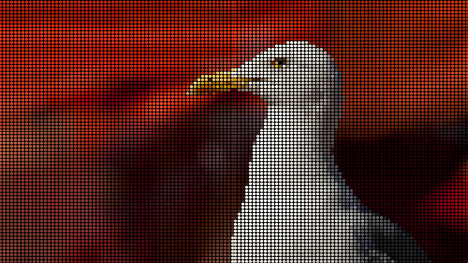

**Labels:**

`Mix[%]`
`Amount`
`Softness[%]`
`Gap[%]`
`Gap Red`
`Gap Green`
`Gap Blue`
`Gap Alpha`
## LumaKey
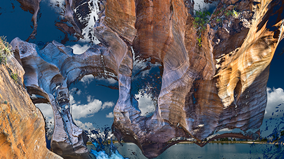

**Labels:**

`Mix[%]`
`MinLuma`
`MaxLuma`
`Softness`
## MagnifyingGlass
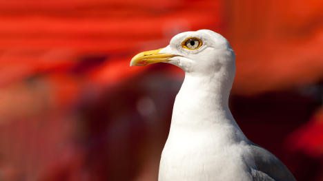

**Labels:**

`Mix[%]`
`Radius`
`xPosition`
`yPosition`
`Scale[%]`
## Mask
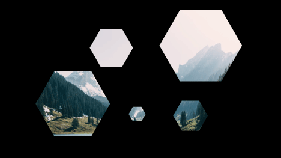

**Labels:**

`Mix[%]`
`Sampler`
`RGB / Alpha`
`Invert`
`Border Alpha`
`Offset X`
`Offset Y`
`Rotate`
`Aspect Ratio`
`Scale X`
`Scale Y`
## MaskRGB

**Labels:**

`Mix[%]`
`Sampler`
## Mirror
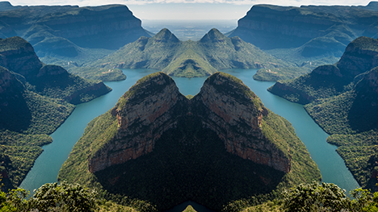

**Labels:**

`Mix[%]`
`MirrorPosition[%]`
`Offset`
## Movement
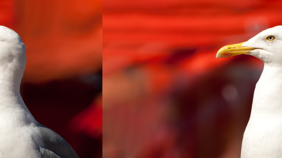

**Labels:**

`Mix[%]`
`Time`
`Speed`
`Vertical`
## MultiplyAlpha

**Labels:**

`Mix[%]`
`Alpha[%]`
## MultiplyColor
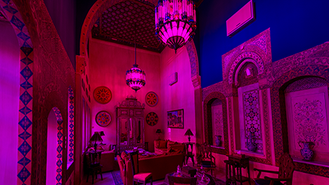

**Labels:**

`Mix[%]`
`Red`
`Green`
`Blue`
`Alpha`
## Negative
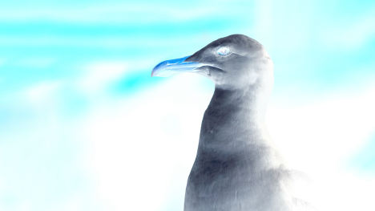

**Labels:**

`Mix`
## Noise
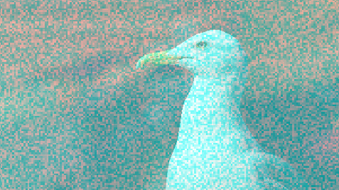

**Labels:**

`Size`
`Strength[%]`
`Time`
`Width[px]`
`Height[px]`
`BlackColor Red`
`BlackColor Green`
`BlackColor Blue`
`BlackColor Alpha`
`WhiteColor Red`
`WhiteColor Green`
`WhiteColor Blue`
`WhiteColor Alpha`
## Opacity
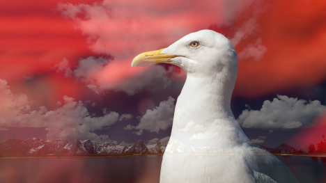

**Labels:**

`Alpha[%]`
## Pixelate
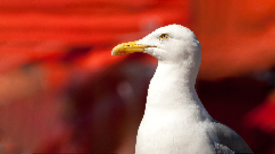

**Labels:**

`Width[px]`
`Height[px]`
`Pixels`
## PolarCoordinates

**Labels:**

`X Pos`
`Y Pos`
`X Scale`
`Y Scale`
`Rotate`
## RaymarchClouds
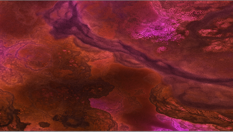

**Labels:**

`Mix[%]`
`time`
`Focus`
`Treshold`
`Foreground Red`
`Foreground Green`
`Foreground Blue`
`Background Red`
`Background Green`
`Background Blue`
## RectMaskSoft

**Labels:**

`Mix[%]`
`Top Left X`
`Top Left Y`
`Top Right X`
`Top Right Y`
`Bottom Left X`
`Bottom Left Y`
`Bottom Right X`
`Bottom Right Y`
`Smoothness`
`Invert`
## ReduceColors
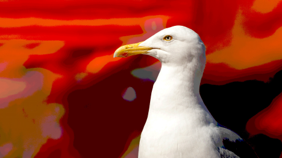

**Labels:**

`Mix[%]`
`RedValues`
`GreenValues`
`BlueValues`
## Reflection
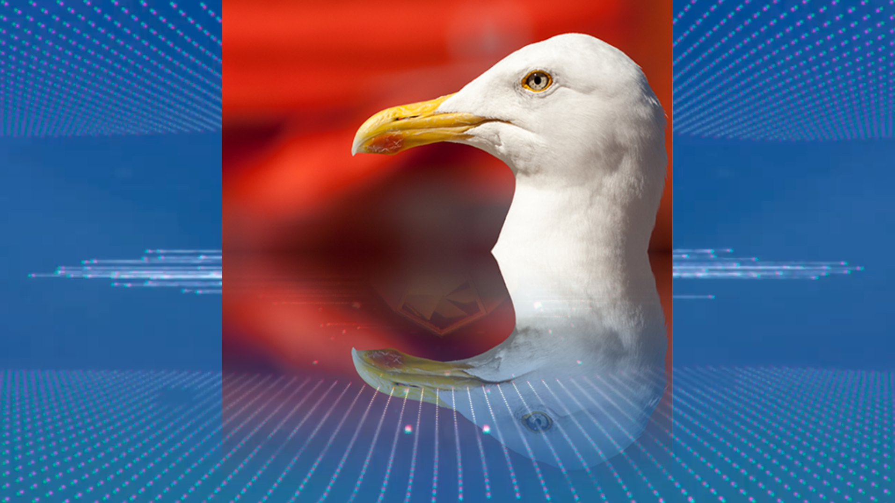

**Labels:**

`Mix[%]`
`Strength`
`PositionY`
## Relief
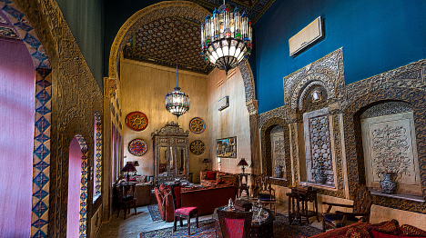

**Labels:**

`Mix[%]`
`Direction`
`Width[px]`
`Height[px]`
## RotateCenter
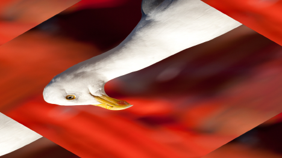

**Labels:**

`Mix[%]`
`Angle`
`Speed`
## Rotation
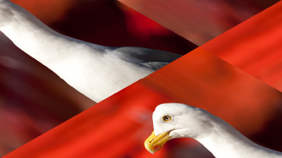

**Labels:**

`Mix[%]`
`Angle`
`Speed`
## Sepia
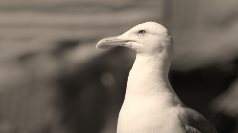

**Labels:**

`Mix[%]`
## Sharpening

**Labels:**

`Mix[%]`
`Width[px]`
`Height[px]`
`Strength`
## Shockwave
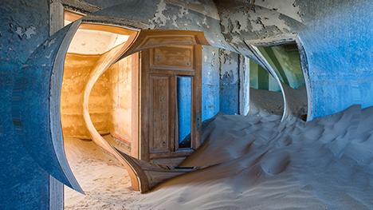

**Labels:**

`Mix[%]`
`Time`
`TimeMultiplier`
## Solarize
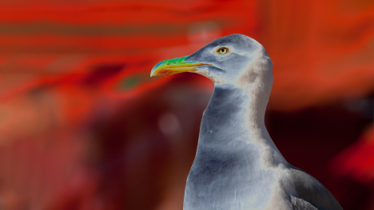

**Labels:**

`Mix`
`Threshold`
`Below`
## SolidColor

**Labels:**

`Mix`
`Red`
`Green`
`Blue`
`Alpha`
## Spill

**Labels:**

`Mix[%]`
`Red`
`Green`
`Blue`
`Lightness`
`Saturation`
`HueTolerance`
`LightnessTolerance`
## SplitColors

**Labels:**

`Strength`
`Angle[deg]`
`Mix[%]`
## Swirl

**Labels:**

`Mix`
`PositionX`
`PositionY`
`Radius`
`Twist`
`Time`
## Tiling

**Labels:**

`Mix[%]`
`Factor`
## TriGradient

**Labels:**

`Mix`
`Position1[%]`
`Position2[%]`
`Width[%]`
`Strength[%]`
`Angle[deg]`
`Color 1 Red`
`Color 1 Green`
`Color 1 Blue`
`Color 1 Alpha`
`Color 2 Red`
`Color 2 Green`
`Color 2 Blue`
`Color 2 Alpha`
`Color 3 Red`
`Color 3 Green`
`Color 3 Blue`
`Color 3 Alpha`
## TriNoise2

**Labels:**

`time`
`amount`
`Mix`
## UVPositionAndScale

**Labels:**

`X Pos`
`Y Pos`
`X Scale`
`Y Scale`
## UVPositionAndScale_Unclamped

**Labels:**

`X Pos`
`Y Pos`
`X Scale`
`Y Scale`
## Vignette

**Labels:**

`Mix[%]`
`Width[%]`
## Wipe

**Labels:**

`Mix[%]`
`X`
`Y`
## Zoom

**Labels:**

`Mix[%]`
`xPosition`
`yPosition`
`Scale[%]`
## DrivingPlates

**Labels:**

`Sampler2`
`Sampler3`
`Sampler4`
`Sampler5`
`Sampler6`
`Sampler7`
`Sampler8`
`Sampler9`
`Position X`
`Position Y`
`Position Z`
`Rotation X`
`Rotation Y`
`Rotation Z`
`FOV`
`AspectRatio`
`Horizontal Feather`
`FOV Ceiling`
`AspectRatio Ceiling`
`Sampler`
## Equirectangular

**Labels:**

`Position X`
`Position Y`
`Position Z`
`Rotation X`
`Rotation Y`
`Rotation Z`
`Sampler`
## EquirectangularRanged

**Labels:**

`Position X`
`Position Y`
`Position Z`
`Rotation X`
`Rotation Y`
`Rotation Z`
`Range Start`
`Range End`
`Sampler`
## EquirectangularRangedBidirectional

**Labels:**

`Position X`
`Position Y`
`Position Z`
`Rotation X`
`Rotation Y`
`Rotation Z`
`Hor Range Start`
`Hor Range End`
`Ver Range Start`
`Ver Range End`
`Sampler`
## Equirectangular_RotYXZ

**Labels:**

`Position X`
`Position Y`
`Position Z`
`Rotation X`
`Rotation Y`
`Rotation Z`
`Sampler`
## Perspective

**Labels:**

`Position X`
`Position Y`
`Position Z`
`Rotation X`
`Rotation Y`
`Rotation Z`
`FOV`
`AspectRatio`
`Sampler`
## Planar

**Labels:**

`Position X`
`Position Y`
`Position Z`
`Rotation X`
`Rotation Y`
`Rotation Z`
`Size`
`AspectRatio`
`Sampler`
