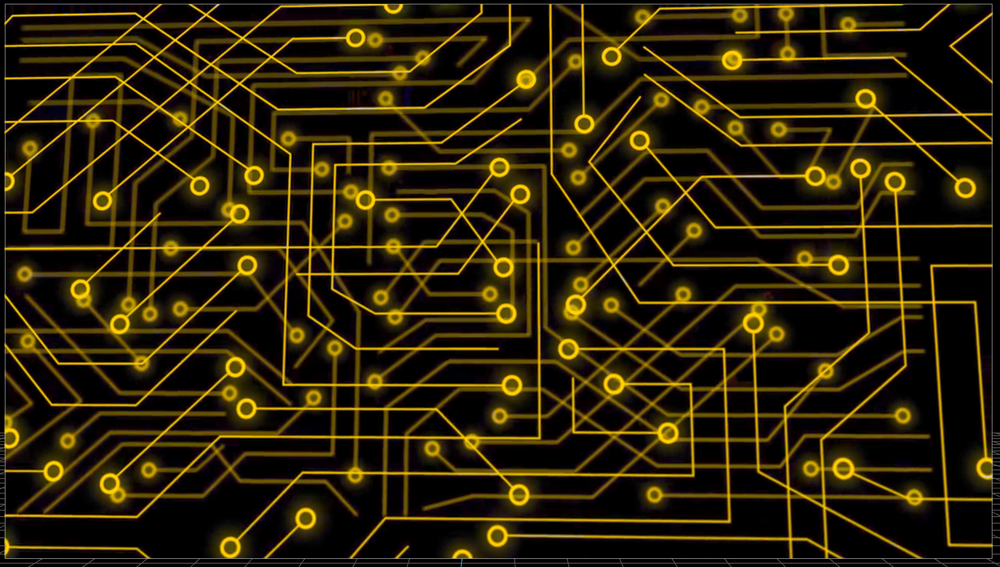
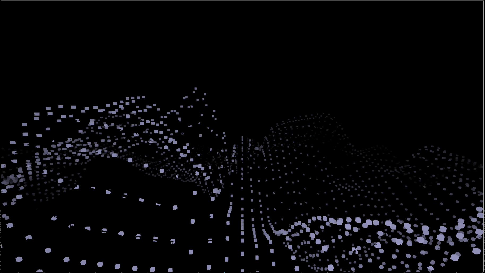
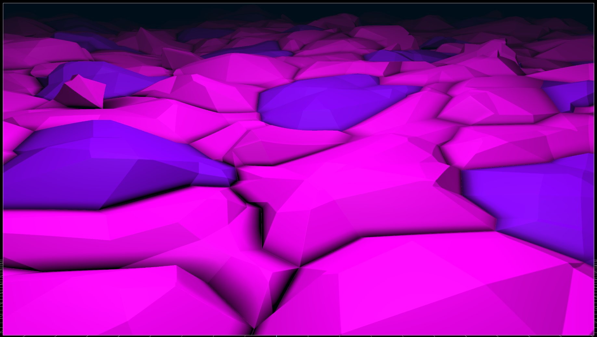
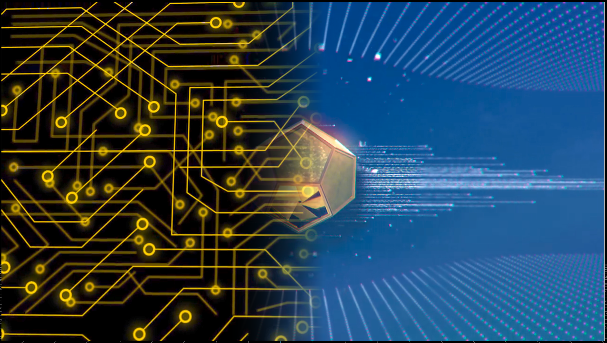

# EFFECTS

## Dry / No Effect

<!--  -->

## Abstract Cubes

> Content independent - Removes content completely
- `time` 
  - Moves time forward in the effect, link to control or keyframe
- `Spacing`
  - Adjusts spacing between blocks
- `Size`
  - Adjusts size of blocks
- `Wave`
  - Adjusts granularity of waves
- `Noise`
  - Adjusts size of noise
- `Red`
  - Adjusts the amount of red in blocks
- `Green`
  - Adjusts the amount of green in blocks
- `Blue`
  - Adjusts the amount of blue in blocks
  - 
## Abstract Plane

> Content independent - Removes content completely
- `time` 
  - Moves time forward in the effect, link to control or keyframe
- `Foreground Red`
  - Adjusts the amount of red in foreground blocks
- `Foreground Green`
  - Adjusts the amount of green in foreground blocks
- `Foreground Blue`
  - Adjusts the amount of blue in foreground blocks
- `Background Red`
  - Adjusts the amount of red in background blocks
- `Background Green`
  - Adjusts the amount of green in background blocks
- `Background Blue`
  - Adjusts the amount of blue in background blocks
  - 
## Alpha Wipe

- `Mix[%]` 
  - Adjusts the amount of the effect is mixed in with the original texture
- `Direction[deg]`
  - Adjusts the direction the wipe is coming from (degrees)
- `Position[%]`
  - Adjusts the postion (completeness) of the wipe
- `Width`
  - Adjusts the width of the wipe
- `Inverse`
  - Swaps the direction of the wipe