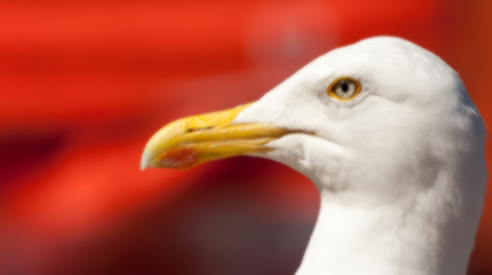
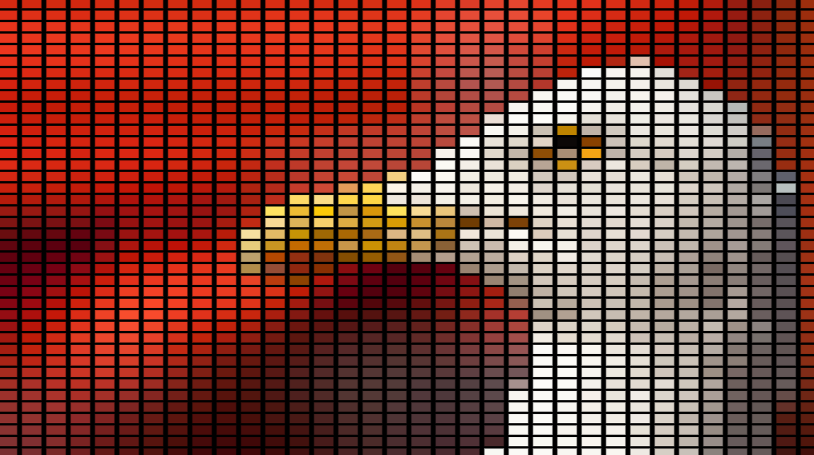
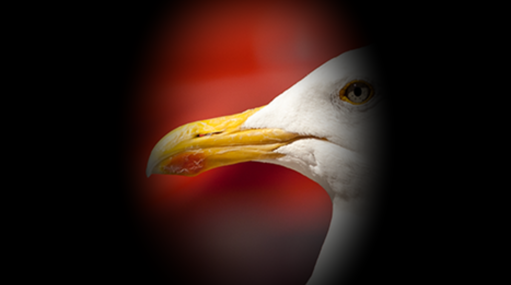

# Effect Overview

## [BoxBlur_Mix](BoxBlur_Mix.glsl)

- Applies a box blur effect over content

> Added in use of Mix%

**Variables:**

`Mix[%]`
`Strength`
`Width[px]`
`Height[px]`
## [LEDEffect_AspectRatio](LEDEffect_AspectRatio.glsl)

- Applies an LED screen effect

> Added aspect ratio and option for square pixels

**Variables:**

`Mix[%]`
`Amount`
`Softness[%]`
`Gap[%]`
`Gap Red`
`Gap Green`
`Gap Blue`
`Gap Alpha`
`Square`
`Width[px]`
`Height[px]`
## [Vignette_AspectRatio](Vignette_AspectRatio.glsl)

-  Applies a vignette effect to the image corners

> Added aspect ratio

**Variables:**

`Mix[%]`
`Strength[%]`
`Width[px]`
`Height[px]`
